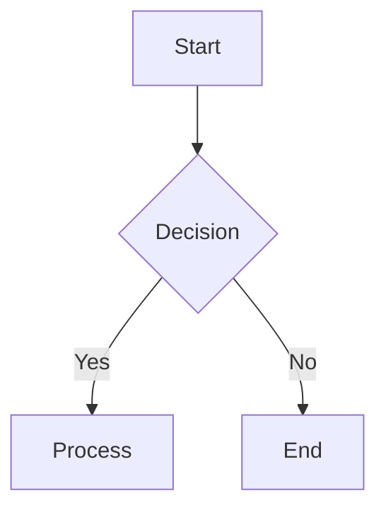

# Sugi

A zero-dependency diagram toolkit that parses Mermaid-compatible syntax, lays out graphs with a custom Sugiyama engine, and renders clean SVG — all at build time, no browser required.

## Why Sugi?

Most diagram tools pull in a massive runtime (Mermaid.js is 1MB+) and require a browser or headless environment to render. Sugi takes a different approach:

- **Zero dependencies** — the core library has no npm dependencies at all
- **Build-time rendering** — diagrams become static SVG during your build, not at runtime
- **Custom layout engine** — a from-scratch Sugiyama implementation replaces dagre entirely
- **Mermaid-compatible** — uses the same syntax your team already knows
- **TypeScript-first** — fully typed API with exported types for everything

## Packages

| Package | Description |
|---------|-------------|
| [`sugi`](./packages/diagram) | Core diagram library — parser, layout engine, SVG renderer |
| [`vitepress-plugin-sugi`](./packages/vitepress-plugin) | VitePress integration — markdown-it plugin + Vite `.mmd` transforms |

## Quick Start

```bash
# Install the core library
pnpm add sugi

# Or the VitePress plugin (includes sugi as a dependency)
pnpm add vitepress-plugin-sugi
```

### Standalone usage

```ts
import { render } from 'sugi'

const svg = render(`
graph TD
  A[Start] --> B{Decision}
  B -->|Yes| C[Process]
  B -->|No| D[End]
`)

// svg is a complete SVG string, ready to embed
```

### VitePress usage

```ts
// .vitepress/config.ts
import { defineConfig } from 'vitepress'
import { diagramPlugin } from 'vitepress-plugin-sugi'

export default defineConfig({
  markdown: {
    config(md) {
      md.use(diagramPlugin)
    }
  }
})
```

Then use fenced code blocks in your markdown:

````md

````

## Supported Diagrams

### Flowchart

```
graph TD
  A[Rectangle] --> B(Rounded)
  B --> C{Diamond}
  C -->|Yes| D((Circle))
  C -->|No| E[/Parallelogram/]
```

Supports all standard shapes (rect, rounded, circle, diamond, hexagon, stadium, subroutine, cylinder, double circle), edge styles (solid, dotted, thick), arrow types (arrow, open, circle, cross), subgraphs, and directional layouts (TD, LR, BT, RL).

### Sequence Diagram

```
sequenceDiagram
  participant A as Alice
  participant B as Bob
  A->>B: Hello
  B-->>A: Hi back
  Note over A,B: They chat
```

Supports participants, actors, messages (solid, dotted, with arrow types), notes (left, right, over), and combined fragments (alt, opt, loop, par, critical, break).

### Class Diagram

```
classDiagram
  class Animal {
    +String name
    +makeSound() void
  }
  class Dog {
    +fetch() void
  }
  Animal <|-- Dog
```

Supports classes with attributes and methods, visibility modifiers (+, -, #, ~), generics, annotations (interface, abstract, enum), namespaces, and all relationship types (inheritance, composition, aggregation, association, dependency, realization).

## Layout Engine

Sugi includes a complete Sugiyama-style layered graph layout algorithm, built from scratch as a zero-dependency replacement for dagre. The pipeline:

1. **Cycle removal** — DFS back-edge reversal
2. **Rank assignment** — topological sort with longest-path ranking
3. **Normalization** — dummy nodes for edges spanning multiple ranks
4. **Crossing minimization** — barycenter heuristic ordering
5. **Coordinate assignment** — median alignment with overlap resolution
6. **Denormalization** — dummy node removal with edge bend-point collection

## Theming

Every visual element can be themed. Colors are semantic — decision nodes get amber, terminal nodes get green, data nodes get purple, process nodes get blue:

```ts
import { render } from 'sugi'

const svg = render(source, {
  theme: {
    // Flowchart shapes
    processFill: '#e8f4fd',
    processStroke: '#4a90d9',
    decisionFill: '#fff3e0',
    decisionStroke: '#e6a23c',
    terminalFill: '#e8f5e9',
    terminalStroke: '#67c23a',
    dataFill: '#f3e8fd',
    dataStroke: '#9b59b6',

    // Sequence diagram
    participantFill: '#e8f4fd',
    participantStroke: '#4a90d9',
    noteFill: '#fef9e7',
    noteStroke: '#d4ac0d',

    // Class diagram
    classHeaderFill: '#4a90d9',
    classHeaderTextColor: '#ffffff',

    // ...and many more
  }
})
```

## Project Structure

```
sugi/
  packages/
    diagram/              # Core library
      src/
        parse/            # Mermaid syntax parsers
          tokenizer.ts    # Token stream + diagram type detection
          flowchart.ts    # Flowchart parser
          sequence.ts     # Sequence diagram parser
          class-diagram.ts
        layout/           # Graph layout algorithms
          engine.ts       # Sugiyama layout engine
          flowchart.ts    # Flowchart layout adapter
          sequence.ts     # Sequence-specific layout
          class-diagram.ts
        render/           # SVG generation
          svg.ts          # SVG primitives
          theme.ts        # Theme interface + defaults
          flowchart.ts    # Flowchart renderer
          sequence.ts     # Sequence renderer
          class-diagram.ts
        util/             # Shared utilities
      tests/
    vitepress-plugin/     # VitePress integration
      src/
        markdown-it.ts    # Fence rule override
        vite.ts           # .mmd file transform plugin
  docs/                   # Documentation site (VitePress)
```

## Development

```bash
# Install dependencies
pnpm install

# Run tests
pnpm test

# Type check
pnpm typecheck

# Build all packages
pnpm build

# Run docs site
pnpm docs:dev
```

## License

MIT
