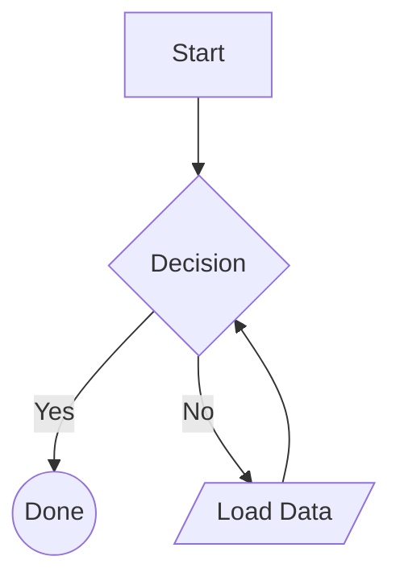
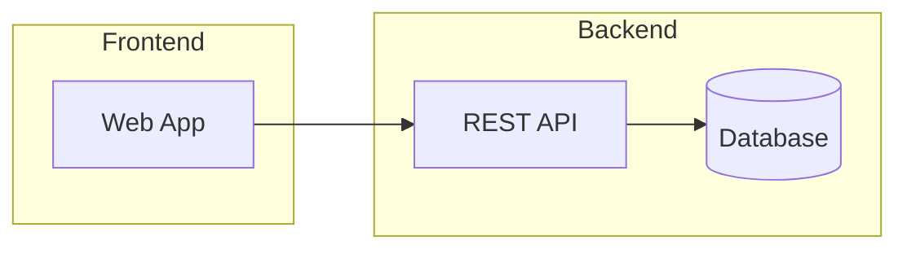
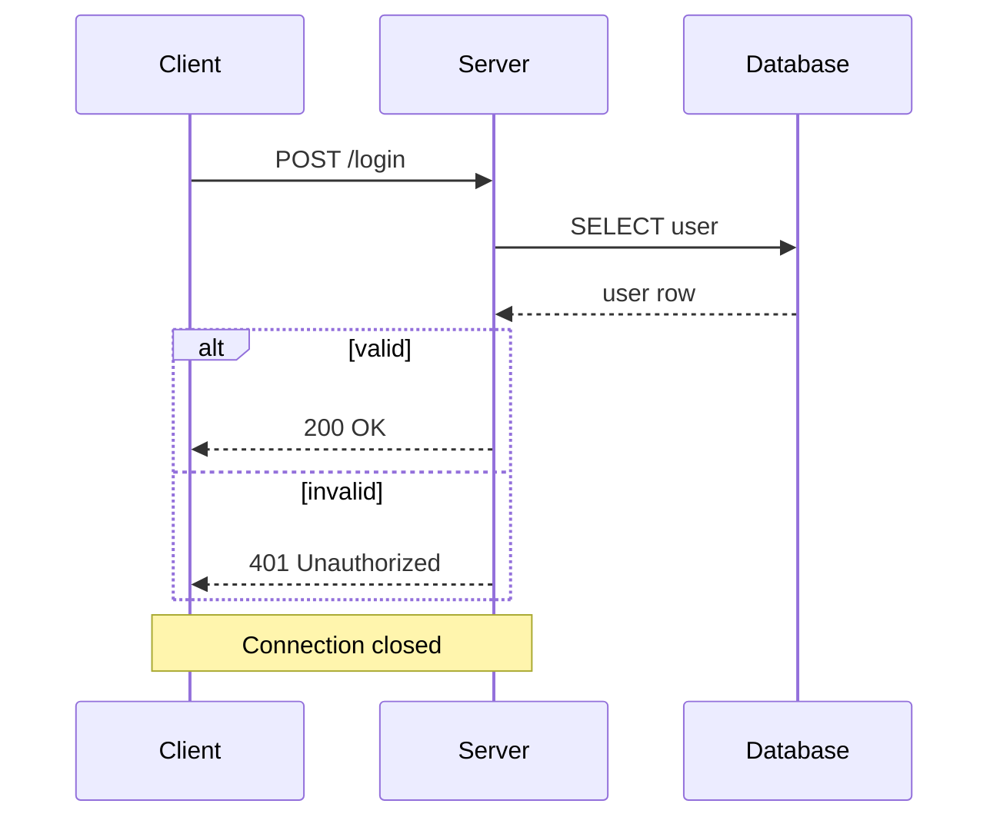
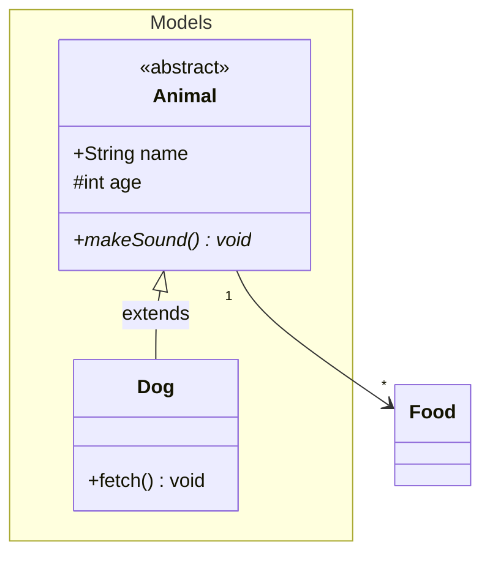

# vitepress-plugin-mermaid-diagram

[](https://www.npmjs.com/package/vitepress-plugin-mermaid-diagram)
[](https://www.npmjs.com/package/vitepress-plugin-mermaid-diagram)
[](LICENSE)

Build-time Mermaid diagram renderer for VitePress. Write standard Mermaid syntax in fenced code blocks and get static SVG output — no mermaid.js runtime, no browser, no headless Chrome.

[Live Demo](https://klanghaus.github.io/vitepress-plugin-mermaid-diagram/) | [npm](https://www.npmjs.com/package/vitepress-plugin-mermaid-diagram) | [GitHub](https://github.com/KlangHaus/vitepress-plugin-mermaid-diagram)

## Features

- **Zero runtime dependencies** — no mermaid.js (1MB+), no D3, no dagre
- **Build-time rendering** — diagrams become static SVG during your build, not in the browser
- **Custom Sugiyama layout engine** — from-scratch layered graph layout, replaces dagre entirely
- **Mermaid-compatible syntax** — uses the same fenced code blocks your team already knows
- **Semantic theming** — decision nodes get amber, terminals get green, data gets purple
- **TypeScript-first** — fully typed API with exported types for everything

### Supported diagrams

| Diagram | Syntax | Features |
| ------- | ------ | -------- |
| Flowchart | `graph TD`, `graph LR` | 10 shapes, 4 edge styles, 4 arrow types, subgraphs, all directions |
| Sequence | `sequenceDiagram` | Participants, actors, messages, notes, alt/opt/loop/par/critical/break |
| Class | `classDiagram` | Attributes, methods, visibility, generics, annotations, namespaces, 6 relationship types |

### Supported flowchart shapes

| Shape | Syntax | Theme color |
| ----- | ------ | ----------- |
| Rectangle | `[text]` | Blue (process) |
| Rounded | `(text)` | Blue (process) |
| Diamond | `{text}` | Amber (decision) |
| Circle | `((text))` | Green (terminal) |
| Stadium | `([text])` | Green (terminal) |
| Hexagon | `{{text}}` | Blue (process) |
| Subroutine | `[[text]]` | Blue (process) |
| Cylinder | `[(text)]` | Purple (data) |
| Parallelogram | `[/text/]` | Purple (data) |
| Double circle | `(((text)))` | Green (terminal) |

## Install

```bash
npm install vitepress-plugin-mermaid-diagram
```

## Setup

### VitePress config

```ts
// .vitepress/config.ts
import { defineConfig } from 'vitepress'
import { diagramPlugin } from 'vitepress-plugin-mermaid-diagram'

export default defineConfig({
  markdown: {
    config(md) {
      md.use(diagramPlugin)
    },
  },
})
```

Any fenced code block with the language `mermaid` or `diagram` is rendered to static SVG at build time. The output is wrapped in a `<div class="vp-diagram">` for styling.

### With theme and layout options

```ts
md.use(diagramPlugin, {
  theme: {
    processFill: '#dbeafe',
    processStroke: '#3b82f6',
    decisionFill: '#fef3c7',
    decisionStroke: '#f59e0b',
    fontSize: 13,
  },
  flowchart: {
    rankdir: 'LR',
    nodesep: 60,
    ranksep: 80,
  },
})
```

## Usage

### Flowchart

````md

````

Edges support solid (`-->`), dotted (`-.->`), and thick (`==>`), with labels (`-->|label|`) and arrow types (arrow, open, circle, cross). Subgraphs group related nodes:

````md

````

### Sequence diagram

````md

````

Supports `participant` (box) and `actor` (stick figure), solid and dotted messages, notes (`Note left of`, `Note right of`, `Note over`), and combined fragments (`alt/else`, `opt`, `loop`, `par`, `critical`, `break`).

### Class diagram

````md

````

Supports visibility modifiers (`+` public, `-` private, `#` protected, `~` internal), generics (`class List~T~`), annotations (`<<interface>>`, `<<abstract>>`, `<<enum>>`), and all relationship types: inheritance (`<|--`), composition (`*--`), aggregation (`o--`), association (`-->`), dependency (`..>`), realization (`..|>`), with cardinality labels.

### Vite plugin for `.mmd` files

Import `.mmd` files directly as SVG strings in Vue components:

```ts
// .vitepress/config.ts
import { viteDiagramPlugin } from 'vitepress-plugin-mermaid-diagram'

export default defineConfig({
  vite: {
    plugins: [viteDiagramPlugin()],
  },
})
```

```vue
<script setup>
import diagram from './architecture.mmd'
</script>

<template>
  <div v-html="diagram" />
</template>
```

## Theming

All theme properties are optional — pass a partial object to override defaults. Colors are semantic by diagram element.

### Flowchart

| Property | Default | Description |
| -------- | ------- | ----------- |
| `processFill` | `#e8f4fd` | Fill for rect, rounded, subroutine, hexagon |
| `processStroke` | `#4a90d9` | Stroke for process nodes |
| `decisionFill` | `#fff3e0` | Fill for diamond nodes |
| `decisionStroke` | `#e6a23c` | Stroke for diamond nodes |
| `terminalFill` | `#e8f5e9` | Fill for circle, stadium nodes |
| `terminalStroke` | `#67c23a` | Stroke for terminal nodes |
| `dataFill` | `#f3e8fd` | Fill for parallelogram, cylinder |
| `dataStroke` | `#9b59b6` | Stroke for data nodes |
| `nodeTextColor` | `#1a3a5c` | Node label text color |
| `subgraphFill` | `#f8fafc` | Subgraph background |
| `subgraphStroke` | `#c0d0e0` | Subgraph border |

### Edges

| Property | Default | Description |
| -------- | ------- | ----------- |
| `edgeColor` | `#6b7b8d` | Edge line color |
| `edgeLabelColor` | `#4a5568` | Edge label text |
| `edgeLabelBg` | `#ffffffdd` | Edge label background |
| `arrowColor` | `#6b7b8d` | Arrowhead fill |

### Sequence diagram

| Property | Default | Description |
| -------- | ------- | ----------- |
| `participantFill` | `#e8f4fd` | Participant box fill |
| `participantStroke` | `#4a90d9` | Participant box border |
| `participantTextColor` | `#1a3a5c` | Participant label |
| `actorColor` | `#4a90d9` | Actor stick figure |
| `lifeline` | `#c0d0e0` | Lifeline dash |
| `noteFill` | `#fef9e7` | Note background |
| `noteStroke` | `#d4ac0d` | Note border |
| `noteTextColor` | `#5a4e1a` | Note text |
| `messageLabelColor` | `#2d3748` | Message label text |
| `blockStroke` | `#9b9b9b` | Fragment block border |
| `blockLabelFill` | `#f0f0f0` | Fragment label background |
| `blockLabelColor` | `#4a4a4a` | Fragment label text |

### Class diagram

| Property | Default | Description |
| -------- | ------- | ----------- |
| `classHeaderFill` | `#4a90d9` | Class header background |
| `classHeaderTextColor` | `#ffffff` | Class header text |
| `classBodyFill` | `#ffffff` | Class body background |
| `classStroke` | `#4a90d9` | Class border |
| `classTextColor` | `#2d3748` | Member text |
| `classSectionStroke` | `#e2e8f0` | Section divider |
| `annotationColor` | `#718096` | Stereotype annotation |
| `namespaceFill` | `#f7fafc` | Namespace background |
| `namespaceStroke` | `#a0aec0` | Namespace border |
| `relationLabelColor` | `#4a5568` | Relationship label |

### Global

| Property | Default | Description |
| -------- | ------- | ----------- |
| `background` | `transparent` | SVG background |
| `fontSize` | `14` | Base font size (px) |
| `fontFamily` | system fonts | Font stack |

## Layout configuration

### Flowchart

```ts
{
  rankdir: 'TD',  // 'TD' | 'LR' | 'BT' | 'RL'
  nodesep: 50,    // horizontal spacing between nodes
  ranksep: 50,    // vertical spacing between ranks
  marginx: 20,    // horizontal margin
  marginy: 20,    // vertical margin
}
```

### Sequence diagram

```ts
{
  participantSpacing: 150,  // horizontal spacing between participants
  messageSpacing: 40,       // vertical spacing between messages
  headerHeight: 50,         // height of the header area
  noteWidth: 120,           // default note width
  padding: 20,              // diagram padding
}
```

## API

### `diagramPlugin(md, options?)`

markdown-it plugin. Renders `mermaid` and `diagram` fenced code blocks to static SVG.

### `viteDiagramPlugin(options?)`

Vite plugin. Transforms `.mmd` file imports into SVG string exports.

### `render(source, options?)`

Core render function. Parses Mermaid syntax and returns an SVG string, or `null` if the diagram type is not recognized.

```ts
import { render } from 'vitepress-plugin-mermaid-diagram'

const svg = render('graph TD\n  A --> B')
```

### Parsers (advanced)

```ts
import {
  parseFlowchart,
  parseSequence,
  parseClassDiagram,
  detectDiagramType,
} from 'vitepress-plugin-mermaid-diagram'

const ast = parseFlowchart('graph TD\n  A --> B')
```

### Layout (advanced)

```ts
import {
  layoutFlowchart,
  layoutSequence,
  layoutClassDiagram,
  renderSVG,
  defaultTheme,
} from 'vitepress-plugin-mermaid-diagram'

const layout = layoutFlowchart(ast, { rankdir: 'LR' })
const svg = renderSVG(layout, 'flowchart', defaultTheme)
```

## How it works

1. VitePress processes your markdown through markdown-it
2. The plugin intercepts fenced code blocks tagged `mermaid` or `diagram`
3. A custom parser converts the Mermaid syntax into an AST
4. A Sugiyama layout engine (6-phase pipeline) positions all nodes and edges
5. An SVG renderer generates a static SVG string
6. The SVG is inserted into the HTML — no JavaScript is sent to the browser

### Sugiyama layout pipeline

| Phase | Algorithm | Purpose |
| ----- | --------- | ------- |
| 1 | DFS back-edge reversal | Remove cycles to ensure a DAG |
| 2 | Kahn's topological sort + longest path | Assign vertical ranks |
| 3 | Dummy node insertion | Handle edges spanning multiple ranks |
| 4 | Barycenter heuristic | Minimize edge crossings |
| 5 | Median alignment + spacing | Assign x/y coordinates |
| 6 | Dummy removal + bend points | Clean up edge routing |

## Styling

The rendered SVGs are wrapped in `<div class="vp-diagram">`:

```css
.vp-diagram {
  display: flex;
  justify-content: center;
  margin: 24px 0;
}

.vp-diagram svg {
  max-width: 100%;
  height: auto;
}
```

## Contributors

<!-- ALL-CONTRIBUTORS-LIST:START -->
<table>
  <tr>
    <td align="center"><a href="https://github.com/allanasp"><br /><sub><b>Allan Asp</b></sub></a></td>
  </tr>
</table>
<!-- ALL-CONTRIBUTORS-LIST:END -->

## License

MIT
