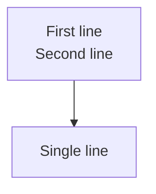

# Configuration

## Theme

Customize the appearance of diagrams with a theme object:

```ts
import { defineConfig } from 'vitepress';
import { diagramPlugin } from 'vitepress-plugin-mermaid-diagram';

export default defineConfig({
  markdown: {
    config(md) {
      md.use(diagramPlugin, {
        theme: {
          processFill: '#dbeafe',
          processStroke: '#3b82f6',
          decisionFill: '#fef3c7',
          decisionStroke: '#f59e0b',
          fontSize: 13,
        },
      });
    },
  },
});
```

## Dark mode

Diagrams use CSS classes on all SVG elements (e.g. `vp-d-process`, `vp-d-decision`). To enable dark mode, add CSS rules that override colors when `.dark` is on an ancestor. SVG presentation attributes have lower specificity than CSS rules, so the overrides work automatically.

### VitePress setup

Add a CSS file to your theme:

```css
/* .vitepress/theme/diagram-dark.css */
.dark .vp-d-process { fill: #1e3a5f; stroke: #63b3ed; }
.dark .vp-d-decision { fill: #4a3728; stroke: #f6ad55; }
.dark .vp-d-terminal { fill: #1a3a2a; stroke: #68d391; }
.dark .vp-d-data { fill: #2d1f3d; stroke: #b794f4; }
.dark .vp-d-node-text { fill: #e2e8f0; }
.dark .vp-d-edge { stroke: #a0aec0; }
/* ... see full list in darkTheme export */
```

Then import it:

```ts
// .vitepress/theme/index.ts
import './diagram-dark.css'
```

### Programmatic access

```ts
import { darkTheme, darkModeCSS, generateDarkModeStyles } from 'vitepress-plugin-mermaid-diagram';

// Pre-generated CSS string using default dark palette
console.log(darkModeCSS);

// Generate CSS from a custom dark theme
const customCSS = generateDarkModeStyles({ ...darkTheme, processFill: '#1e293b' });
```

### Standalone usage (non-VitePress)

When using `render()` directly (not through the markdown-it plugin), set `darkTheme` to embed a `<style>` block inside the SVG:

```ts
import { render } from 'vitepress-plugin-mermaid-diagram';

// Dark mode styles embedded in SVG (default)
const svg = render('graph TD\n  A --> B');

// Disable embedded dark mode styles
const svgNoDark = render('graph TD\n  A --> B', { darkTheme: false });

// Custom dark palette
const svgCustom = render('graph TD\n  A --> B', {
  darkTheme: { processFill: '#1e293b' },
});
```

## Multiline labels

Use `\n` in node labels to create multiline text:

````md

````

Multiline labels are rendered using `<tspan>` elements, centered vertically within the node.

## Responsive SVG

Diagrams render with `width`, `height`, and `viewBox` attributes. The wrapper `<div>` has inline styles for responsive behavior (`max-width: 100%`, overflow scroll). No external CSS is needed — diagrams scale down on small screens automatically.

## Flowchart theme

| Property | Default | Description |
| -------- | ------- | ----------- |
| `processFill` | `#e8f4fd` | Fill for rect, rounded, subroutine, hexagon |
| `processStroke` | `#4a90d9` | Stroke for process nodes |
| `decisionFill` | `#fff3e0` | Fill for diamond nodes |
| `decisionStroke` | `#e6a23c` | Stroke for diamond nodes |
| `terminalFill` | `#e8f5e9` | Fill for circle, stadium nodes |
| `terminalStroke` | `#67c23a` | Stroke for terminal nodes |
| `dataFill` | `#f3e8fd` | Fill for parallelogram, cylinder |
| `dataStroke` | `#9b59b6` | Stroke for data nodes |
| `nodeTextColor` | `#1a3a5c` | Node label text color |
| `subgraphFill` | `#f8fafc` | Subgraph background |
| `subgraphStroke` | `#c0d0e0` | Subgraph border |
| `subgraphLabelColor` | `#5a7a9a` | Subgraph label text |

## Edge theme

| Property | Default | Description |
| -------- | ------- | ----------- |
| `edgeColor` | `#6b7b8d` | Edge line color |
| `edgeLabelColor` | `#4a5568` | Edge label text |
| `edgeLabelBg` | `#ffffffdd` | Edge label background |
| `arrowColor` | `#6b7b8d` | Arrowhead fill |

## Sequence diagram theme

| Property | Default | Description |
| -------- | ------- | ----------- |
| `participantFill` | `#e8f4fd` | Participant box fill |
| `participantStroke` | `#4a90d9` | Participant box border |
| `participantTextColor` | `#1a3a5c` | Participant label color |
| `actorColor` | `#4a90d9` | Actor stick figure color |
| `lifeline` | `#c0d0e0` | Lifeline dash color |
| `activationFill` | `#d0e4f5` | Activation bar fill |
| `noteFill` | `#fef9e7` | Note background |
| `noteStroke` | `#d4ac0d` | Note border |
| `noteTextColor` | `#5a4e1a` | Note text color |
| `messageLabelColor` | `#2d3748` | Message label text |
| `blockStroke` | `#9b9b9b` | Fragment block border |
| `blockLabelFill` | `#f0f0f0` | Fragment label background |
| `blockLabelColor` | `#4a4a4a` | Fragment label text |

## Class diagram theme

| Property | Default | Description |
| -------- | ------- | ----------- |
| `classHeaderFill` | `#4a90d9` | Class header background |
| `classHeaderTextColor` | `#ffffff` | Class header text |
| `classBodyFill` | `#ffffff` | Class body background |
| `classStroke` | `#4a90d9` | Class border |
| `classTextColor` | `#2d3748` | Member text color |
| `classSectionStroke` | `#e2e8f0` | Section divider |
| `annotationColor` | `#718096` | Stereotype annotation |
| `namespaceFill` | `#f7fafc` | Namespace background |
| `namespaceStroke` | `#a0aec0` | Namespace border |
| `namespaceLabelColor` | `#4a5568` | Namespace label text |
| `relationLabelColor` | `#4a5568` | Relationship label |

## Global theme

| Property | Default | Description |
| -------- | ------- | ----------- |
| `background` | `transparent` | SVG background |
| `fontSize` | `14` | Base font size (px) |
| `fontFamily` | system fonts | Font stack |

## Layout configuration

### Flowchart

```ts
md.use(diagramPlugin, {
  flowchart: {
    nodesep: 50,    // Horizontal spacing between nodes
    ranksep: 50,    // Vertical spacing between ranks
    marginx: 20,    // Horizontal margin
    marginy: 20,    // Vertical margin
    rankdir: 'TD',  // Direction: TD, LR, BT, RL
  },
});
```

### Sequence

```ts
md.use(diagramPlugin, {
  sequence: {
    participantSpacing: 150,  // Spacing between participants
    messageSpacing: 40,       // Spacing between messages
    headerHeight: 50,         // Header area height
    noteWidth: 120,           // Default note width
    padding: 20,              // Diagram padding
  },
});
```

### Class Diagram

```ts
md.use(diagramPlugin, {
  classDiagram: {
    nodesep: 60,    // Spacing between classes
    ranksep: 80,    // Spacing between hierarchy levels
  },
});
```

## Preview component

Enable `preview: true` to wrap diagrams in a `DiagramPreview` component:

```ts
md.use(diagramPlugin, { preview: true });
```

This requires registering the component in your VitePress theme:

```ts
// .vitepress/theme/index.ts
import DefaultTheme from 'vitepress/theme'
import DiagramPreview from 'vitepress-plugin-mermaid-diagram/DiagramPreview.vue'
import 'vitepress-plugin-mermaid-diagram/diagram-dark.css'

export default {
  extends: DefaultTheme,
  enhanceApp({ app }) {
    app.component('DiagramPreview', DiagramPreview)
  },
}
```

Features:
- **Preview / Code tabs** — toggle between rendered diagram and mermaid source
- **Fullscreen** — open in a full-screen overlay with pan & zoom
- **Pan & zoom** — scroll to zoom (0.1x–10x), drag to pan, reset button
- **Keyboard** — Esc to close fullscreen

## Standalone usage

The `render` function can be used outside VitePress:

```ts
import { render } from 'vitepress-plugin-mermaid-diagram';

const svg = render(`graph TD
  A --> B --> C
`, {
  theme: { processFill: '#dff0d8' },
});

// svg is a string containing <svg>...</svg>
```

Returns `null` if the diagram type is not recognized.
