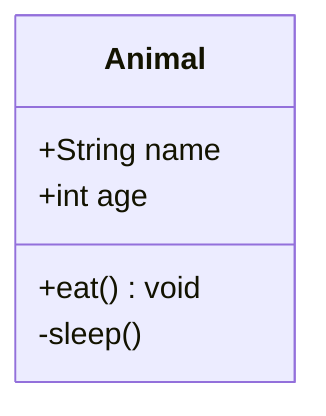
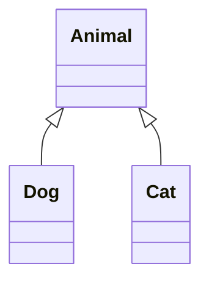
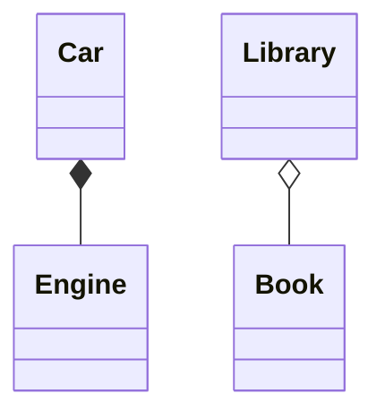
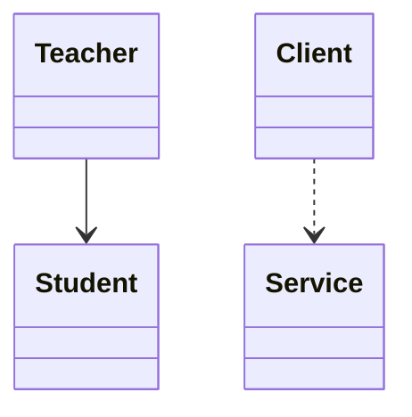
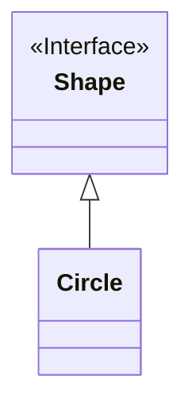
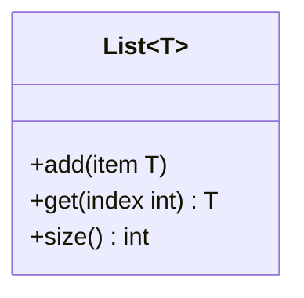
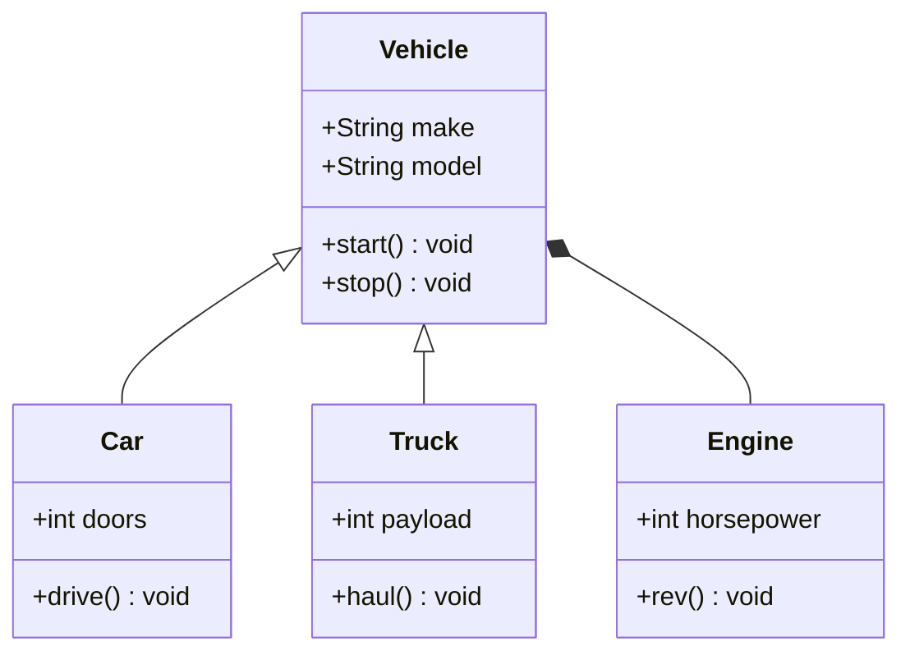

# Class Diagram

Class diagrams show the structure of a system using classes, attributes, methods, and relationships.

## Basic Class

## Relationships

### Inheritance

### Composition & Aggregation

### Association & Dependency

## Annotations

## Generic Types

## Full Example

