# Flowchart

Flowcharts use the `graph` or `flowchart` keyword followed by a direction.

## Directions

| Keyword | Direction |
|---------|-----------|
| `TD` / `TB` | Top to bottom |
| `BT` | Bottom to top |
| `LR` | Left to right |
| `RL` | Right to left |

### Top-Down

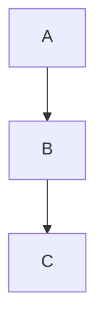

### Left-Right

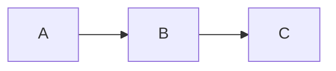

## Node Shapes

### Rectangle

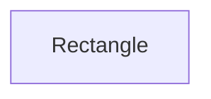

### Rounded

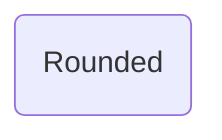

### Circle

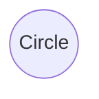

### Diamond (decision)

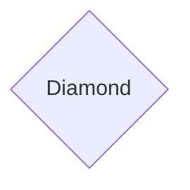

### Hexagon

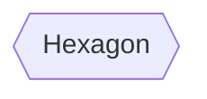

### Stadium / pill

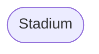

### All shapes together

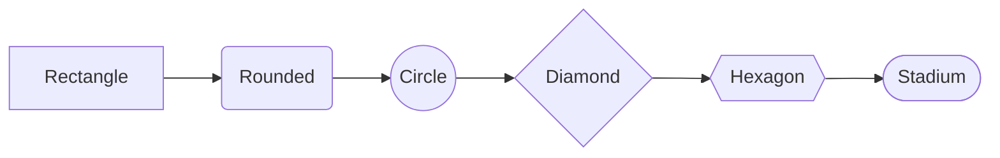

## Edge Types

### Solid arrow

### Dotted arrow

### Thick arrow

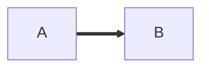

### No arrow (line)

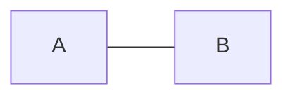

### Circle arrow

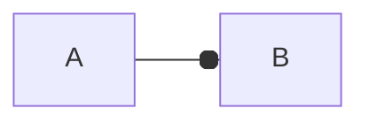

### Cross arrow

## Edge Labels

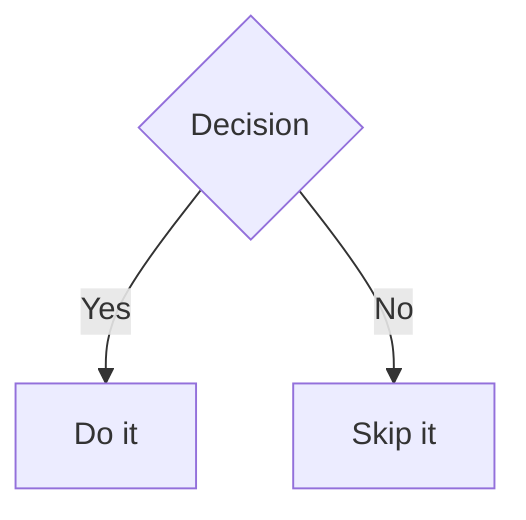

## Node Chains

Multiple nodes and edges on one line:

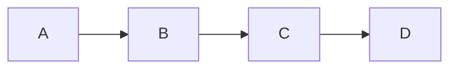

## Subgraphs

Group nodes in subgraphs:

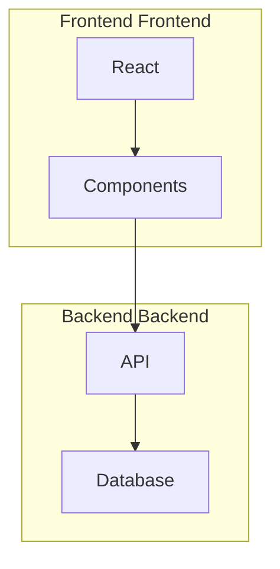

## Full Example

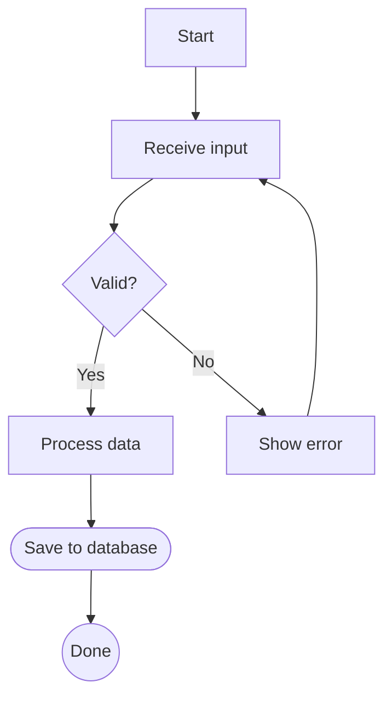
