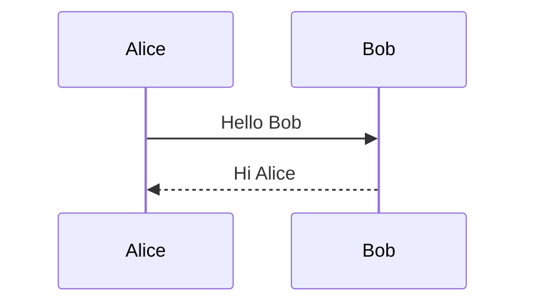
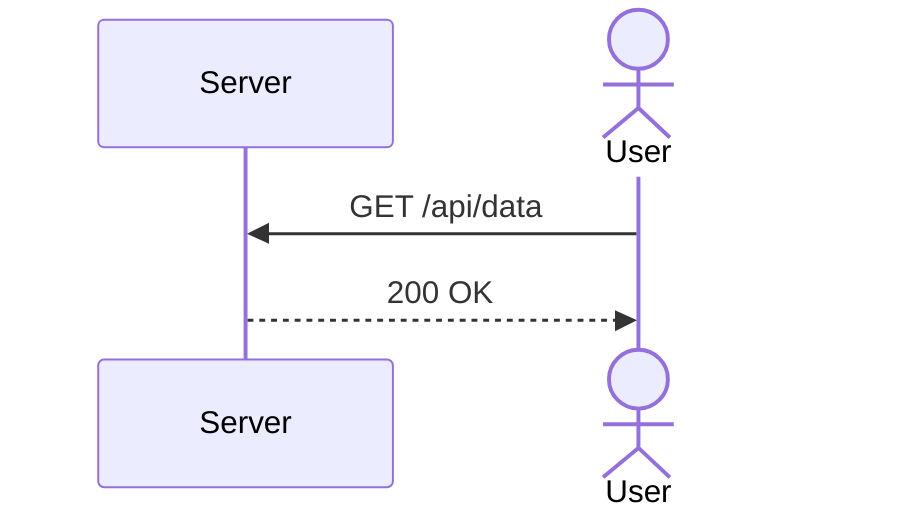
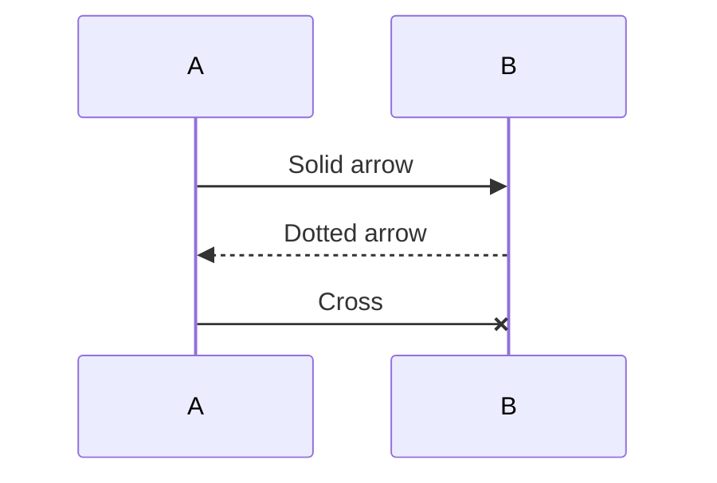
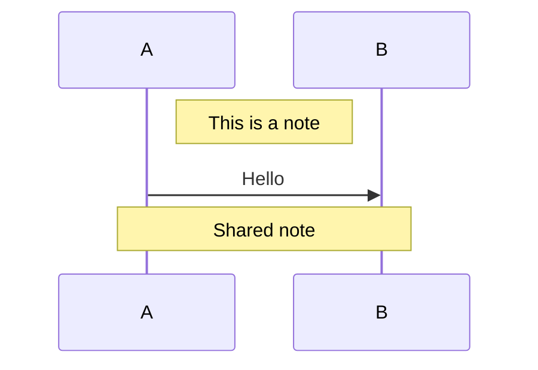
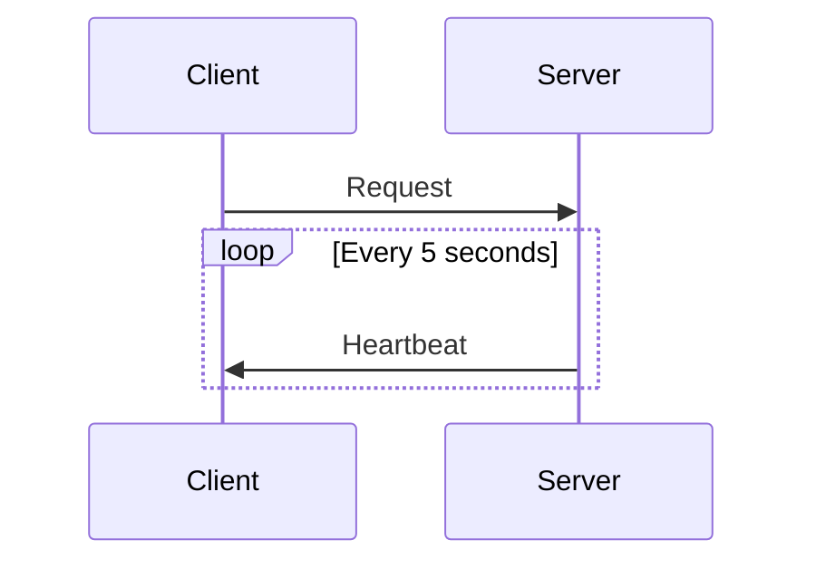
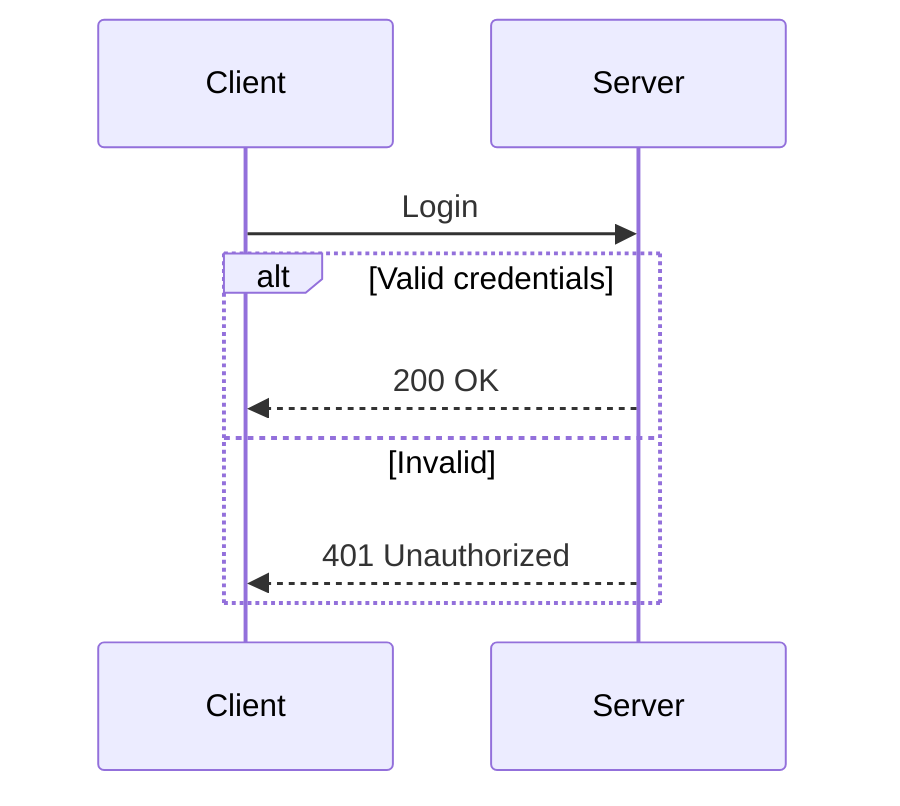
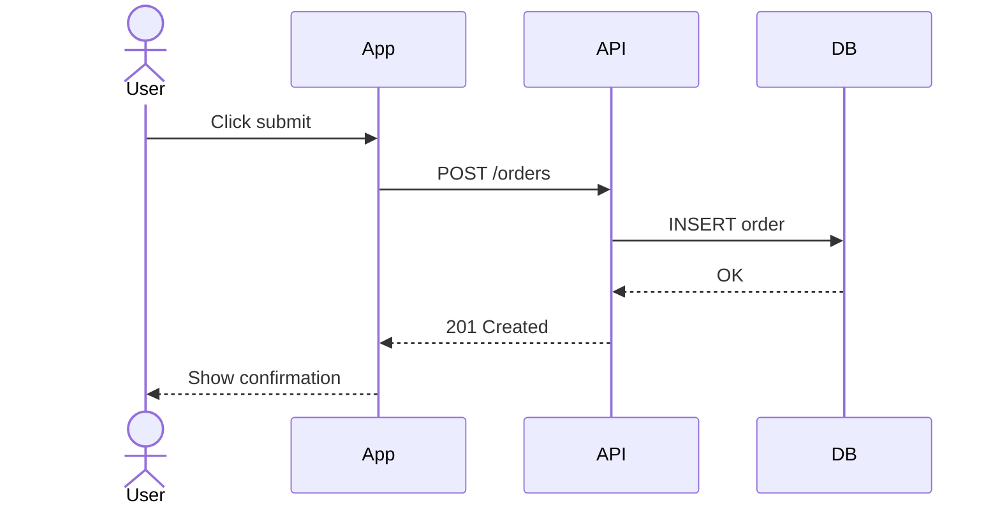

# Sequence Diagram

Sequence diagrams show interactions between participants over time.

## Basic Messages

## Participants & Actors

## Arrow Types

| Syntax | Style |
|--------|-------|
| `->` | Solid, open head |
| `->>` | Solid, filled head |
| `-->` | Dotted, open head |
| `-->>` | Dotted, filled head |
| `-x` | Solid, cross |
| `--x` | Dotted, cross |

## Notes

## Loops

## Alt / Else

## Full Example

