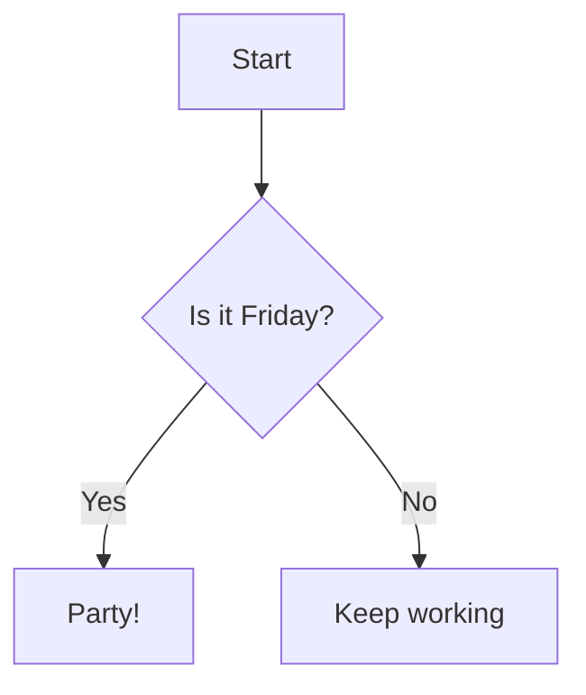

# Getting Started

## Installation

```bash
npm install vitepress-plugin-mermaid-diagram
```

## Configuration

Add the plugin to your VitePress config:

```ts
// .vitepress/config.ts
import { defineConfig } from 'vitepress';
import { diagramPlugin } from 'vitepress-plugin-mermaid-diagram';

export default defineConfig({
  markdown: {
    config(md) {
      md.use(diagramPlugin);
    },
  },
});
```

## Usage

Write diagrams in ` ```mermaid ` code blocks in your markdown files:

````md

````

Result:


## Supported diagram types

| Type | Keyword | Docs |
|------|---------|------|
| Flowchart | `graph TD` / `flowchart LR` | [See docs](/diagrams/flowchart) |
| Sequence | `sequenceDiagram` | [See docs](/diagrams/sequence) |
| Class | `classDiagram` | [See docs](/diagrams/class-diagram) |

## Vite plugin for `.mmd` files

You can also import `.mmd` files directly:

```ts
// .vitepress/config.ts
import { viteDiagramPlugin } from 'vitepress-plugin-mermaid-diagram';

export default defineConfig({
  vite: {
    plugins: [viteDiagramPlugin()],
  },
});
```

```vue
<script setup>
import diagram from './architecture.mmd'
</script>

<template>
  <div v-html="diagram" />
</template>
```

## Standalone API

```ts
import { render } from 'vitepress-plugin-mermaid-diagram';

const svg = render(`graph TD
  A --> B --> C
`);

console.log(svg); // <svg xmlns="...">...</svg>
```
