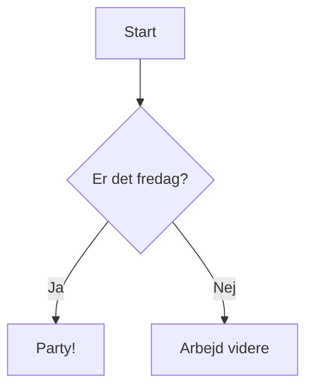

# Getting Started

## Installation

```bash
npm install vitepress-plugin-diagram
```

## Konfiguration

Tilf\u00f8j pluginnet til din VitePress config:

```ts
// .vitepress/config.ts
import { defineConfig } from 'vitepress';
import { diagramPlugin } from 'vitepress-plugin-diagram';

export default defineConfig({
  markdown: {
    config(md) {
      md.use(diagramPlugin);
    },
  },
});
```

## Brug

Skriv diagrammer i ` ```mermaid ` code blocks i dine markdown-filer:

````md

````

Resultatet:


## Understøttede diagramtyper

| Type | Keyword | Eksempel |
|------|---------|----------|
| Flowchart | `graph TD` / `flowchart LR` | [Se docs](/diagrams/flowchart) |
| Sequence | `sequenceDiagram` | [Se docs](/diagrams/sequence) |
| Class | `classDiagram` | [Se docs](/diagrams/class-diagram) |

## Vite Plugin (`.mmd` filer)

Du kan også importere `.mmd`-filer direkte:

```ts
// vite.config.ts
import { viteDiagramPlugin } from 'vitepress-plugin-diagram';

export default {
  plugins: [viteDiagramPlugin()],
};
```

```ts
// I din kode
import diagramSvg from './architecture.mmd';
document.getElementById('diagram').innerHTML = diagramSvg;
```

## Standalone API

```ts
import { renderDiagram } from 'vitepress-plugin-diagram';

const svg = renderDiagram(`graph TD
  A --> B --> C
`);

console.log(svg); // <svg xmlns="...">...</svg>
```
