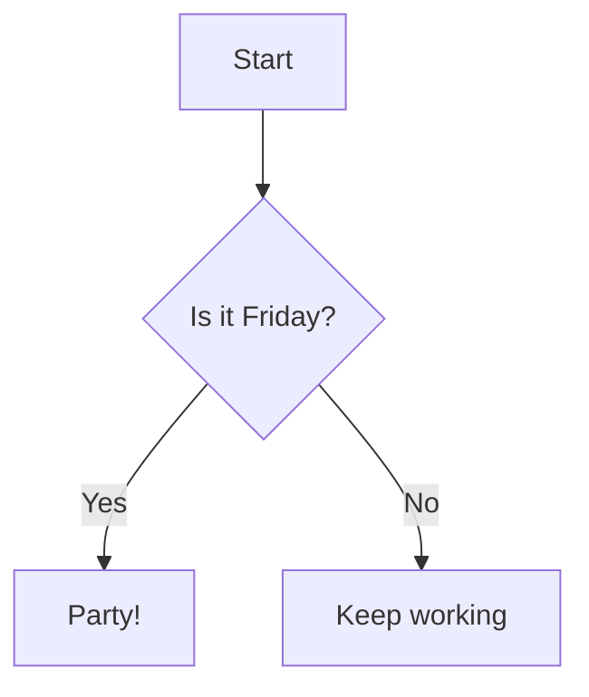

# Getting Started

## Installation

```bash
npm install vitepress-plugin-mermaid-diagram
```

## Basic setup

Add the plugin to your VitePress config:

```ts
// .vitepress/config.ts
import { defineConfig } from 'vitepress';
import { diagramPlugin } from 'vitepress-plugin-mermaid-diagram';

export default defineConfig({
  markdown: {
    config(md) {
      md.use(diagramPlugin);
    },
  },
});
```

## Enhanced setup (recommended)

Enable `preview: true` for an interactive diagram viewer with code tabs, fullscreen, pan & zoom:

```ts
// .vitepress/config.ts
import { defineConfig } from 'vitepress';
import { diagramPlugin } from 'vitepress-plugin-mermaid-diagram';

export default defineConfig({
  markdown: {
    config(md) {
      md.use(diagramPlugin, { preview: true });
    },
  },
});
```

Then register the component and import dark mode CSS in your theme:

```ts
// .vitepress/theme/index.ts
import DefaultTheme from 'vitepress/theme'
import DiagramPreview from 'vitepress-plugin-mermaid-diagram/DiagramPreview.vue'
import 'vitepress-plugin-mermaid-diagram/diagram-dark.css'

export default {
  extends: DefaultTheme,
  enhanceApp({ app }) {
    app.component('DiagramPreview', DiagramPreview)
  },
}
```

This gives you:
- **Preview / Code tabs** — switch between rendered diagram and mermaid source
- **Fullscreen** — open diagram in a full-screen overlay
- **Pan & zoom** — scroll to zoom (0.1x–10x), drag to pan
- **Dark mode** — automatic color switching when VitePress toggles dark mode

## Usage

Write diagrams in ` ```mermaid ` code blocks in your markdown files:

````md

````

Result:


## Supported diagram types

| Type | Keyword | Docs |
|------|---------|------|
| Flowchart | `graph TD` / `flowchart LR` | [See docs](/diagrams/flowchart) |
| Sequence | `sequenceDiagram` | [See docs](/diagrams/sequence) |
| Class | `classDiagram` | [See docs](/diagrams/class-diagram) |

## Vite plugin for `.mmd` files

You can also import `.mmd` files directly:

```ts
// .vitepress/config.ts
import { viteDiagramPlugin } from 'vitepress-plugin-mermaid-diagram';

export default defineConfig({
  vite: {
    plugins: [viteDiagramPlugin()],
  },
});
```

```vue
<script setup>
import diagram from './architecture.mmd'
</script>

<template>
  <div v-html="diagram" />
</template>
```

## Standalone API

```ts
import { render } from 'vitepress-plugin-mermaid-diagram';

const svg = render(`graph TD
  A --> B --> C
`);

console.log(svg); // <svg xmlns="...">...</svg>
```
