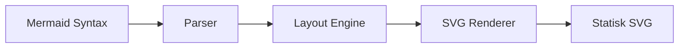
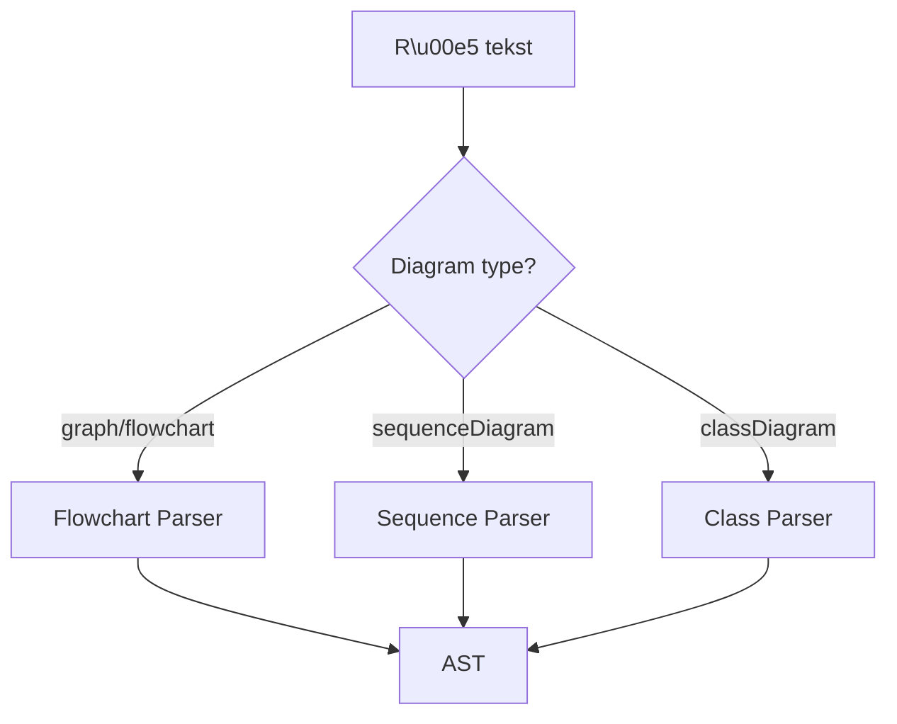
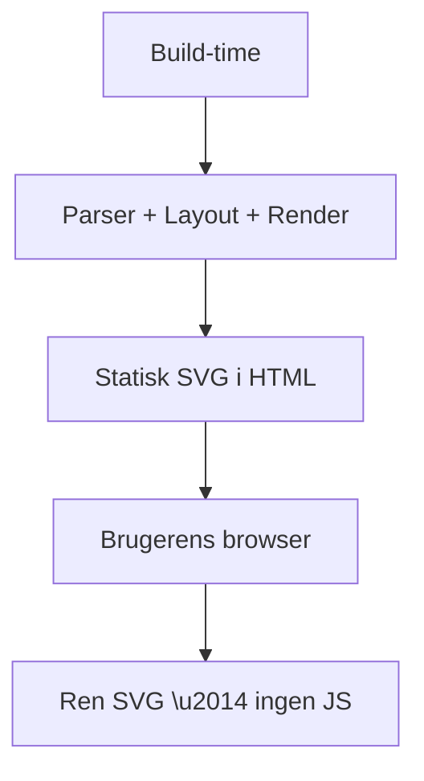

# Hvordan det virker

## Arkitektur

Pluginnet behandler diagrammer i 4 trin:



### 1. Detection

Pluginnet scanner markdown ` ```mermaid ` code blocks og identificerer diagramtypen fra f\u00f8rste linje:

- `graph TD` / `flowchart LR` &#8594; Flowchart
- `sequenceDiagram` &#8594; Sequence
- `classDiagram` &#8594; Class

### 2. Parsing

Hvert diagramtype har sin egen hand-written recursive descent parser. Ingen parser-generatorer eller tunge dependencies.



Parseren producerer et AST (Abstract Syntax Tree) med nodes, edges, relationer etc.

### 3. Layout

Layout-engineen beregner positioner for alle elementer:

- **Flowchart + Class**: Bruger `@dagrejs/dagre` (Sugiyama-baseret layered graph layout)
- **Sequence**: Custom kolonne-algoritme (deltagere i kolonner, beskeder som rækker)

### 4. SVG Rendering

SVG genereres som rene strings \u2014 ingen DOM, ingen browser. Tekst-bredde estimeres med en character-width lookup tabel.

## Ingen client-side JavaScript



Alt parsing, layout-beregning og SVG-rendering sker n\u00e5r VitePress bygger dit site. Slutbrugeren modtager kun ren SVG indlejret i HTML.

## Sammenlignet med mermaid.js

| | vitepress-plugin-diagram | mermaid.js |
|---|---|---|
| Rendering | Build-time (server) | Client-side (browser) |
| Bundle size | ~53 KB | ~2 MB |
| Client JS | 0 KB | ~800 KB min+gzip |
| Dependencies | 1 (dagre) | 20+ |
| Diagram types | 3 | 15+ |
| Browser DOM | Ikke p\u00e5kr\u00e6vet | P\u00e5kr\u00e6vet |
