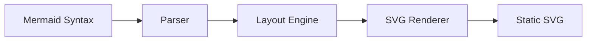
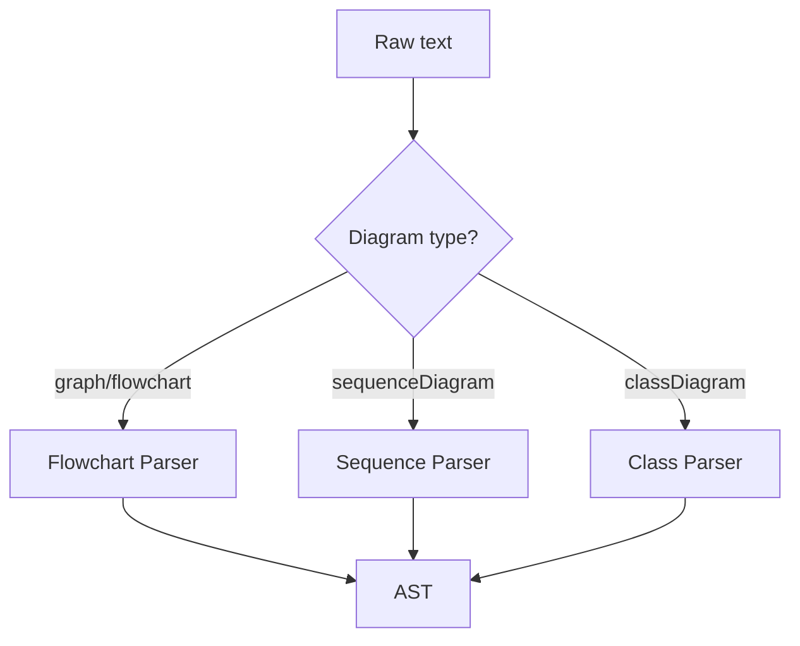
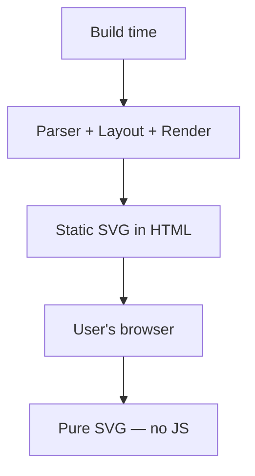

# How It Works

## Architecture

The plugin processes diagrams in 4 steps:



### 1. Detection

The plugin scans markdown ` ```mermaid ` code blocks and identifies the diagram type from the first line:

- `graph TD` / `flowchart LR` — Flowchart
- `sequenceDiagram` — Sequence
- `classDiagram` — Class

### 2. Parsing

Each diagram type has its own hand-written recursive descent parser. No parser generators or heavy dependencies.



The parser produces an AST (Abstract Syntax Tree) with nodes, edges, relationships, etc.

### 3. Layout

The layout engine calculates positions for all elements:

- **Flowchart + Class**: Custom Sugiyama-style layered graph layout (zero dependencies, replaces dagre)
- **Sequence**: Custom column-based algorithm (participants in columns, messages as rows)

#### Sugiyama pipeline

| Phase | Algorithm | Purpose |
| ----- | --------- | ------- |
| 1 | DFS back-edge reversal | Remove cycles to ensure a DAG |
| 2 | Kahn's topological sort + longest path | Assign vertical ranks |
| 3 | Dummy node insertion | Handle edges spanning multiple ranks |
| 4 | Barycenter heuristic | Minimize edge crossings |
| 5 | Median alignment + spacing | Assign x/y coordinates |
| 6 | Dummy removal + bend points | Clean up edge routing |

### 4. SVG Rendering

SVG is generated as pure strings — no DOM, no browser. Text width is estimated with a character-width lookup table.

## No client-side JavaScript



All parsing, layout calculation, and SVG rendering happens when VitePress builds your site. The end user receives only pure SVG embedded in HTML.

## Compared to mermaid.js

| | vitepress-plugin-mermaid-diagram | mermaid.js |
|---|---|---|
| Rendering | Build-time (server) | Client-side (browser) |
| Bundle size | ~60 KB | ~2 MB |
| Client JS | 0 KB | ~800 KB min+gzip |
| Dependencies | 0 | 20+ |
| Diagram types | 3 | 15+ |
| Browser DOM | Not required | Required |
