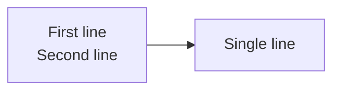
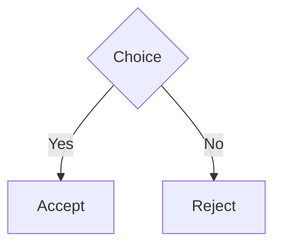
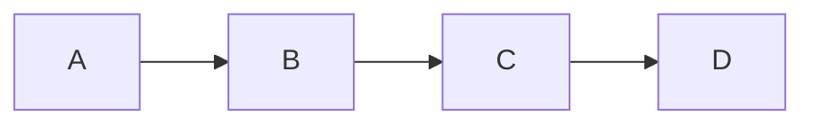
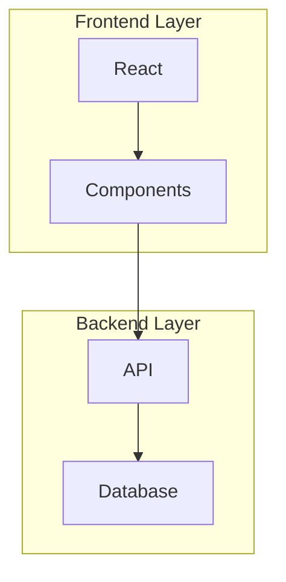

# Mermaid Syntax Reference

This plugin supports a subset of [Mermaid.js](https://mermaid.js.org/) syntax. All parsing happens at build time with zero dependencies.

## Diagram types

| Type | Header | Directions |
|------|--------|------------|
| Flowchart | `graph TD` or `flowchart LR` | `TD`, `TB`, `BT`, `LR`, `RL` |
| Sequence | `sequenceDiagram` | — |
| Class | `classDiagram` | Optional `direction TD` etc. |

## Flowchart

### Node shapes

| Shape | Syntax | Example |
|-------|--------|---------|
| Rectangle | `[text]` | `A[Start]` |
| Rounded | `(text)` | `A(Process)` |
| Circle | `((text))` | `A((Hub))` |
| Double circle | `(((text)))` | `A(((End)))` |
| Stadium / pill | `([text])` | `A([Terminal])` |
| Subroutine | `[[text]]` | `A[[Function]]` |
| Cylinder | `[(text)]` | `A[(Database)]` |
| Hexagon | `{{text}}` | `A{{Prepare}}` |
| Diamond | `{text}` | `A{Decision?}` |
| Asymmetric | `>text]` | `A>Flag]` |
| Parallelogram | `[/text/]` | `A[/Input/]` |
| Parallelogram alt | `[\text\]` | `A[\Output\]` |
| Trapezoid | `[/text\]` | `A[/Wide\]` |
| Trapezoid alt | `[\text/]` | `A[\Narrow/]` |

Implicit nodes (ID without shape syntax) default to rectangles: `A --> B` creates two rectangles.

### Multiline labels

Use `\n` in labels to create multiple lines:



### Edge types

| Pattern | Style | Arrow | Example |
|---------|-------|-------|---------|
| `-->` | solid | arrow | `A --> B` |
| `---` | solid | none | `A --- B` |
| `--o` | solid | circle | `A --o B` |
| `--x` | solid | cross | `A --x B` |
| `-.->` | dotted | arrow | `A -.-> B` |
| `==>` | thick | arrow | `A ==> B` |
| `===` | thick | none | `A === B` |

Longer dashes increase the minimum edge length: `---->` spans more ranks than `-->`.

### Edge labels



### Node chains

Multiple edges on one line:



### Subgraphs



Subgraphs can be nested. The title is optional: `subgraph ID` uses the ID as title.

### Comments

Lines starting with `%%` are ignored:

```
graph TD
  %% This is a comment
  A --> B
```

### Ignored directives

The following are parsed but have no effect: `direction`, `classDef`, `class`, `style`, `click`.

---

## Sequence diagram

### Participants

```
sequenceDiagram
  participant Alice
  actor Bob
  participant Carol as Carol Smith
```

`participant` renders as a box, `actor` as a stick figure. The `as` clause sets a display label.

Participants referenced in messages are auto-created if not declared.

### Messages

| Arrow | Line | Head | Example |
|-------|------|------|---------|
| `->` | solid | open | `Alice -> Bob: text` |
| `->>` | solid | arrow | `Alice ->> Bob: text` |
| `-x` | solid | cross | `Alice -x Bob: text` |
| `-)` | solid | open | `Alice -) Bob: text` |
| `-->` | dotted | open | `Alice --> Bob: text` |
| `-->>` | dotted | arrow | `Alice -->> Bob: text` |
| `--x` | dotted | cross | `Alice --x Bob: text` |
| `--)` | dotted | open | `Alice --) Bob: text` |

### Activation

Inline with `+` (activate) and `-` (deactivate) suffixes:

```
Alice ->> Bob+: Request
Bob -->> Alice-: Response
```

Or standalone:

```
activate Alice
deactivate Alice
```

### Notes

```
Note right of Alice: Important
Note left of Bob: Reminder
Note over Alice,Bob: Shared note
```

### Blocks

| Type | Description |
|------|-------------|
| `loop` | Loop block |
| `alt` / `else` | If-then-else |
| `opt` | Optional |
| `par` / `and` | Parallel |
| `critical` / `option` | Critical section |
| `break` | Break |
| `rect` | Box region |

```
sequenceDiagram
  Alice ->> Bob: Request
  alt Success
    Bob -->> Alice: 200 OK
  else Failure
    Bob -->> Alice: 500 Error
  end
```

Blocks can be nested without depth limit.

---

## Class diagram

### Class declaration

```
classDiagram
  class Animal
  class Dog~Breed~
  class Cat : Feline
```

Generics use `~Type~` syntax. The `: Label` syntax sets a display label.

### Class body

```
classDiagram
  class Animal {
    +String name
    -int age
    +eat(food) void
    #sleep() void
  }
```

### Member visibility

| Prefix | Visibility |
|--------|------------|
| `+` | public |
| `-` | private |
| `#` | protected |
| `~` | internal |

Suffixes: `$` for static, `*` for abstract.

### Annotations

```
classDiagram
  class List~T~ {
    <<Interface>>
    +add(item) void
    +size() int
  }
```

Supported: `<<Interface>>`, `<<Abstract>>`, `<<Enumeration>>`, `<<Service>>`.

### Relationships

| Pattern | Type | Description |
|---------|------|-------------|
| `<\|--` | Inheritance | Solid line, triangle head |
| `*--` | Composition | Solid line, filled diamond |
| `o--` | Aggregation | Solid line, open diamond |
| `<..` | Realization | Dashed line, triangle head |
| `..>` | Dependency | Dashed line, arrow head |
| `-->` | Association | Solid line, arrow head |
| `--` | Link (solid) | Solid line, no head |
| `..` | Link (dashed) | Dashed line, no head |

All patterns work in both directions (e.g. `<|--` and `--|>`).

#### Labels and cardinality

```
classDiagram
  Animal <|-- Dog : extends
  Owner "1" --> "*" Pet : owns
```

### Namespaces

```
classDiagram
  namespace Animals {
    class Dog
    class Cat
  }
```

---

## Differences from mermaid.js

### Supported

- Flowcharts with all 14 node shapes
- All edge styles and arrow types
- Nested subgraphs
- Sequence diagrams with participants, actors, messages, notes, and control blocks
- Class diagrams with members, relationships, annotations, generics, and namespaces
- Comments (`%%`)

### Not supported

- State diagrams, ER diagrams, Gantt charts, pie charts, git graphs, and other diagram types
- Styling directives (`classDef`, `style`, `click`)
- Markdown in labels (bold, italic, links)
- HTML in labels (`<br/>`, `<b>`, etc.)
- Fontawesome icons
- Interaction callbacks
- Theme configuration blocks
