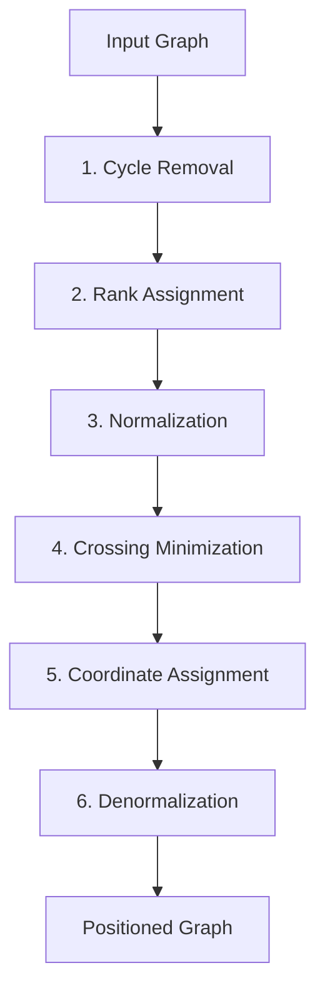

# Sugiyama Layout Algorithm

The plugin uses a custom implementation of the Sugiyama layered graph layout algorithm to position flowchart and class diagram nodes. This replaces the popular `@dagrejs/dagre` library with zero dependencies.

## Overview

The algorithm organizes a directed graph into horizontal layers, placing nodes at distinct ranks with edges flowing in a consistent direction. The layout is computed in 6 phases, each solving a specific sub-problem.

## Phase 1: Cycle Removal

**Goal:** Make the graph acyclic so that layering is possible.

**Algorithm:** Depth-first search (DFS) with back-edge detection.

The traversal maintains a `visited` set and an `inStack` set. When an edge points to a node already in the current DFS stack, it's a back-edge forming a cycle. Back-edges are reversed (source and target swapped) and marked with a `reversed` flag so they can be restored later.

After this phase, the graph is a DAG (directed acyclic graph).

## Phase 2: Rank Assignment

**Goal:** Assign each node to a horizontal layer (rank) that respects edge direction.

**Algorithm:** Longest-path variant of Kahn's topological sort.

1. Source nodes (in-degree = 0) start at rank 0
2. Nodes are processed in topological order using a queue
3. Each node's rank is set to the maximum of `rank(predecessor) + minlen` across all incoming edges
4. The `minlen` parameter (default 1) can force edges to span multiple layers

This ensures all edges point forward in the rank ordering.

## Phase 3: Normalization

**Goal:** Break long edges into chains of short edges between adjacent layers.

When an edge spans more than one rank (`rank(target) - rank(source) > 1`), dummy nodes are inserted at each intermediate rank. The original edge is replaced by a chain: `source -> dummy1 -> dummy2 -> ... -> target`.

Dummy nodes have zero width and height. They're removed after coordinate assignment, but their positions define the bend points for edge routing.

## Phase 4: Crossing Minimization

**Goal:** Order nodes within each layer to minimize edge crossings.

**Algorithm:** Iterative barycenter heuristic (24 passes).

For each node in a layer, calculate the **barycenter** (average position) of its connected neighbors in the adjacent layer. Sort nodes by their barycenter value.

The algorithm alternates direction:
- Even passes: process layers top-down, using predecessor positions
- Odd passes: process layers bottom-up, using successor positions

After each pass, count edge crossings. Keep the best ordering found across all iterations. Stop early if zero crossings or no improvement.

**Crossing detection:** For each pair of edges between two adjacent layers, an inversion (crossing) occurs when the relative order of sources differs from the relative order of targets.

## Phase 5: Coordinate Assignment

**Goal:** Calculate final x/y positions with proper spacing.

Three substeps:

### Initial placement

Nodes in each layer are placed left-to-right with `nodesep` spacing, then centered around the origin.

### Median alignment (30 iterations)

For each node, calculate the median x-position of its neighbors. Pull the node toward this median, alternating between using predecessors and successors.

After each iteration, resolve overlaps by sliding nodes rightward to maintain minimum separation. The median (not mean) is used because it's more robust to outliers.

### Y positioning

Compute the maximum node height per rank. Accumulate y-coordinates with `ranksep` spacing between layer edges (not centers). Center each node vertically within its rank.

Finally, shift all coordinates so the top-left is at (0, 0).

## Phase 6: Denormalization

**Goal:** Remove dummy nodes and collect edge bend points.

1. **Direct edges** (span = 1): Create a point pair from source center to target center
2. **Chained edges** (span > 1): Collect coordinates of all dummy nodes in the chain, forming the bend points for a smooth edge path
3. If the edge was reversed in Phase 1, reverse the point order to restore the original direction
4. Delete all dummy nodes from the output

## Direction Transform

The entire algorithm computes layout in top-to-bottom (TB) coordinates. After Phase 6, a direction transform is applied:

| Direction | Transform |
|-----------|-----------|
| `TD` / `TB` | No change |
| `BT` | Flip y-coordinates vertically |
| `LR` | Swap x and y coordinates (transpose) |
| `RL` | Swap x and y, then flip horizontally |

This is much simpler than computing the layout in arbitrary directions.

## Compound Groups (Subgraphs)

Subgraph nodes are excluded from the layout algorithm. After all positions are calculated, bounding boxes are computed for each group by finding the min/max coordinates of its children, with 20px padding.

Groups are layout-derived, not layout-constraining — children position freely, then group bounds wrap around them.

## Configuration

| Parameter | Default | Description |
|-----------|---------|-------------|
| `nodesep` | 50 | Horizontal spacing between nodes in the same layer |
| `ranksep` | 50 | Vertical spacing between layers |
| `marginx` | 20 | Horizontal canvas margin |
| `marginy` | 20 | Vertical canvas margin |

## Complexity

| Phase | Complexity | Notes |
|-------|-----------|-------|
| Cycle removal | O(V + E) | Single DFS traversal |
| Rank assignment | O(V + E) | Topological sort |
| Normalization | O(E) | One pass over edges |
| Crossing minimization | O(24 * V log V * E) | 24 iterations with sorting |
| Coordinate assignment | O(30 * V^2) | 30 iterations with overlap resolution |
| Denormalization | O(E) | One pass over edges |

Practical for graphs up to several hundred nodes.
