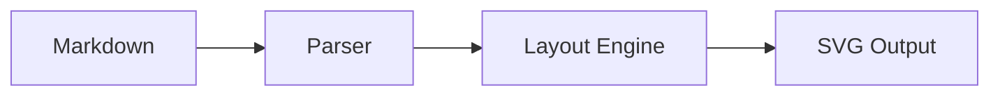

## Quick Example

Write this in your markdown:

````md

```mermaid
graph LR
  A[Markdown] --> B[Parser]
  B --> C[Layout Engine]
  C --> D[SVG Output]
```
````

And you get:


```mermaid
graph LR
  A[Markdown] --> B[Parser]
  B --> C[Layout Engine]
  C --> D[SVG Output]
```
