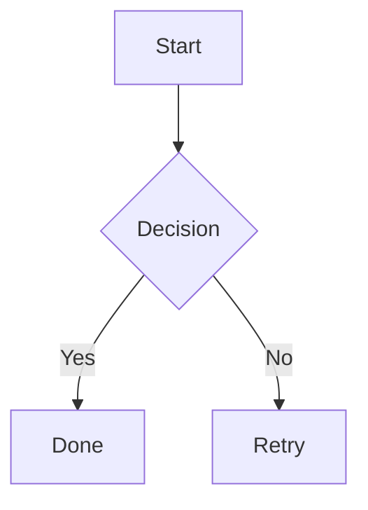

# vitepress-plugin-sugi

VitePress plugin for rendering Mermaid-compatible diagrams at build time. Diagrams become static SVG during the build — no client-side JavaScript, no Mermaid runtime.

Powered by [sugi](../diagram), a zero-dependency diagram engine.

## Install

```bash
pnpm add vitepress-plugin-sugi
```

## Setup

### markdown-it plugin

Add the diagram plugin to your VitePress config:

```ts
// .vitepress/config.ts
import { defineConfig } from 'vitepress'
import { diagramPlugin } from 'vitepress-plugin-sugi'

export default defineConfig({
  markdown: {
    config(md) {
      md.use(diagramPlugin)
    }
  }
})
```

Now any fenced code block with the language `mermaid` or `diagram` will be rendered to SVG at build time:

````md

````

The rendered SVG is wrapped in a `<div class="vp-diagram">` for styling.

### With theme options

```ts
md.use(diagramPlugin, {
  theme: {
    processFill: '#dbeafe',
    processStroke: '#3b82f6',
    fontSize: 13,
  }
})
```

See the [sugi theme documentation](../diagram#theming) for all available theme properties.

### With layout options

```ts
md.use(diagramPlugin, {
  flowchart: {
    rankdir: 'LR',
    nodesep: 60,
    ranksep: 80,
  },
  sequence: {
    participantSpacing: 180,
    messageSpacing: 50,
  },
})
```

## Vite plugin for `.mmd` files

Import `.mmd` files directly as SVG strings in your Vue components:

```ts
// .vitepress/config.ts
import { defineConfig } from 'vitepress'
import { diagramPlugin, viteDiagramPlugin } from 'vitepress-plugin-sugi'

export default defineConfig({
  vite: {
    plugins: [viteDiagramPlugin()]
  },
  markdown: {
    config(md) {
      md.use(diagramPlugin)
    }
  }
})
```

Then in a Vue component:

```vue
<script setup>
import diagram from './my-diagram.mmd'
</script>

<template>
  <div v-html="diagram" />
</template>
```

## Styling

The rendered SVGs are wrapped in `<div class="vp-diagram">`. You can target this class for custom styling:

```css
.vp-diagram {
  display: flex;
  justify-content: center;
  margin: 24px 0;
}

.vp-diagram svg {
  max-width: 100%;
  height: auto;
}
```

## Supported Diagrams

All diagram types supported by [sugi](../diagram) work out of the box:

- **Flowchart** — `graph TD`, `graph LR`, with all shapes and edge styles
- **Sequence diagram** — participants, actors, messages, notes, combined fragments
- **Class diagram** — classes, members, relationships, namespaces, annotations

## How It Works

1. VitePress processes your markdown through markdown-it
2. The plugin intercepts fenced code blocks tagged `mermaid` or `diagram`
3. sugi parses the Mermaid syntax into an AST
4. The Sugiyama layout engine positions all nodes and edges
5. A static SVG string is generated and inserted into the HTML
6. No JavaScript is sent to the browser — diagrams are pure SVG

## API

### `diagramPlugin(md, options?)`

markdown-it plugin. Replaces `mermaid`/`diagram` fenced code blocks with rendered SVG.

- **md** `MarkdownIt` — markdown-it instance
- **options** `RenderOptions` — theme and layout configuration

### `viteDiagramPlugin(options?)`

Vite plugin. Transforms `.mmd` file imports into SVG string exports.

- **options** `RenderOptions` — theme and layout configuration
- **returns** `Plugin` — Vite plugin

### `RenderOptions`

```ts
interface RenderOptions {
  theme?: Partial<Theme>
  flowchart?: FlowchartLayoutConfig
  sequence?: SequenceLayoutConfig
  classDiagram?: ClassLayoutConfig
}
```

Re-exported from `sugi` for convenience.

## License

MIT
